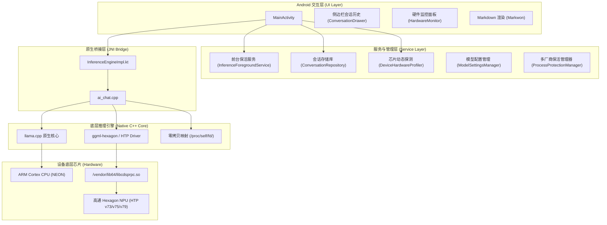

# llama-npu-android

[](examples/llama.android/LICENSE)
[](https://developer.android.com)
[](https://www.qualcomm.com)
[](https://github.com/pohsblzisgwc/llama-npu-android)

> **AI 开发声明 / AI Development Notice**:
> 本项目由 **AI（Google Antigravity / Gemini）** 辅助生成与协同开发，包含端侧 NPU 硬件加速适配、零拷贝直读架构、多厂商后台保活守护及全离线异构推理优化。
> This project is designed and developed with the assistance of AI (Google Antigravity / Gemini).

**llama-npu-android** 是基于 `llama.cpp` 原生 C/C++ 核心与 Qualcomm Hexagon HTP 扩展构建的 Android 端侧大语言模型（LLM）与多模态（VLM）离线推理应用。深度协同移动端 NPU 硬件与多核 ARM Cortex CPU，实现全离线异构计算加速。

---

## 目录 (Table of Contents)

- [核心特性 (Key Features)](#核心特性-key-features)
- [系统架构 (System Architecture)](#系统架构-system-architecture)
- [硬件与后端支持 (Hardware Support)](#硬件与后端支持-hardware-support)
- [快速开始 (Getting Started)](#快速开始-getting-started)
- [编译与构建 (Building)](#编译与构建-building)
- [性能调优建议 (Optimization Tips)](#性能调优建议-optimization-tips)
- [安全与隐私保护 (Privacy & Security)](#安全与隐私保护-privacy--security)
- [开源协议与致谢 (License & Acknowledgements)](#开源协议与致谢-license--acknowledgements)

---

## 核心特性 (Key Features)

### 1. 深度 NPU 硬件加速
- **模型层硬件卸载**：深度适配高通骁龙 Hexagon Tensor Processor (HTP v73 / v75 / v79)，支持将适配的模型层卸载至 NPU 执行；在遇到未适配算子或内存超限时自动平滑降级至 CPU 混合计算。
- **KV 优化与注意力加速**：支持 Q8_0 KV Cache 与 FlashAttention 机制，降低端侧自注意力计算与内存带宽压力。

### 2. SAF 零拷贝直读架构
- **无须复制导入**：集成 Android 存储访问框架 (SAF)，直接获取外部存储 URI 对应的底层文件描述符 (`/proc/self/fd/`)。
- **瞬时加载与磁盘零损耗**：以系统底层只读映射加载数 GB 级别 GGUF 模型文件，避免重复拷贝带来的闪存写入磨损与存储空间浪费。

### 3. 通用移动硬件自适应探测
- **动态芯片识别**：内置通用移动硬件探测器 (`DeviceHardwareProfiler`)，动态解析 `/proc/cpuinfo`、SoC 硬件属性与多核拓扑，根据设备物理内存与核心数智能推荐线程数与上下文窗口，杜绝机型硬编码。
- **自适应后端分配**：搭载高通骁龙芯片的设备优先调度 Hexagon NPU 进行硬件加速；在其它平台（如联发科天玑、三星猎户座、Google Tensor）上自动匹配多线程 ARM NEON CPU 进行推理。

### 4. 多厂商深度保活守护
- **前台服务守护**：基于 `InferenceForegroundService` 提供通知栏常驻与推理状态实时同步。
- **多品牌后台保护引导**：针对小米/Redmi、华为、荣耀、OPPO、vivo、三星等深度定制 ROM，提供一键引导跳转系统设置、电池优化豁免 (`REQUEST_IGNORE_BATTERY_OPTIMIZATIONS`) 与 CPU WakeLock，防止后台推理被系统终止。

### 5. 现代化交互与完整生态
- **多会话持久化**：支持多对话管理、自动命名、历史记录持久化存储与会话切换。
- **流式 Markdown 渲染**：基于 Markwon 引擎实现流式打字机效果与完整 Markdown 语法高亮渲染。
- **多模态离线视觉理解**：支持集成载入 `mmproj` 离线投影模型，实现端侧离线图像对话理解。
- **实时硬件运行监控**：实时面板显示当前计算后端（NPU / CPU）、实时测得的生成吞吐速度 (tokens/s)、系统可用内存及芯片温度状态。

---

## 系统架构 (System Architecture)



---

## 硬件与后端支持 (Hardware Support)

| 硬件平台 | 推荐计算后端 | 架构与实现 | 状态说明 |
| :--- | :--- | :--- | :--- |
| **高通骁龙 8 Elite** | **Hexagon NPU** | HTP v79 架构指令集支持 | 支持 |
| **高通骁龙 8 Gen 3** | **Hexagon NPU** | HTP v75 架构，支持 Q8_0 KV Cache 与 FlashAttention | 支持 |
| **高通骁龙 8 Gen 2** | **Hexagon NPU** | HTP v73 架构 | 支持 |
| **高通骁龙 7+ Gen 2 / Gen 3** | **Hexagon NPU** | HTP v73 / v75 架构 | 支持 |
| **联发科天玑 / 三星 Exynos** | **ARM Cortex CPU** | 多核 ARM NEON 向量加速多线程并行 | 支持 |
| **Google Tensor / 通用 ARM 设备** | **ARM Cortex CPU** | 多核 ARM NEON 向量加速多线程并行 | 支持 |

---

## 快速开始 (Getting Started)

1. **准备模型**：
   - 推荐使用适合端侧内存容量的 GGUF 格式模型，例如：
     - `Qwen2.5-3B-Instruct-Q4_K_M.gguf`
     - `Llama-3.2-3B-Instruct-Q4_K_M.gguf`
   - 将 GGUF 模型存储至手机内部存储任意可读目录。
2. **加载模型**：
   - 启动应用，点击右上角设置图标打开**模型与硬件设置**。
   - 点击“选择模型文件”，通过系统存储访问框架（SAF）点选模型文件（通过 `/proc/self/fd/` 进行零拷贝直读）。
   - 高通骁龙平台选择加速模式为 **Dedicated Hardware Accelerator (Qualcomm Hexagon NPU)**。
   - 点击“应用并重载”，应用将初始化 NPU 驱动并载入模型权重。
3. **开始对话**：
   - 模型加载完毕后，在输入框键入文本，应用将调用加速核心执行流式解码输出，并实时显示 tokens/s 生成速度与硬件资源开销。

---

## 编译与构建 (Building)

### 构建前置依赖
- **Android SDK**：API Level 36 (Android 16)
- **Android NDK**：26+（测试推荐 `29.0.14206865`）
- **CMake**：3.22+
- **JDK**：17+

### 构建步骤

```bash
# 1. 克隆代码仓库
git clone https://github.com/pohsblzisgwc/llama-npu-android.git
cd llama-npu-android/examples/llama.android

# 2. 编译 Release 或 Debug APK
./gradlew assembleDebug --no-daemon

# 3. 输出 APK 文件路径
# app/build/outputs/apk/debug/app-debug.apk
```

---

## 性能调优建议 (Optimization Tips)

1. **上下文长度 (Context Length)**：端侧移动设备建议设置上下文大小为 `2048` ~ `4096`，以平衡 NPU SRAM 占用与响应延迟。
2. **KV 缓存精度**：开启 Q8_0 KV Cache 可有效降低端侧内存带宽压力，提升自注意力解码吞吐。
3. **模型量化类型**：推荐选用 `Q4_K_M` 或 `Q4_0`，在保证推理精度的同时提高端侧向量单元计算效率。
4. **后台守护**：长文本或批次推理前建议在应用内授予“忽略电池优化”，并将应用锁定在系统后台任务列表中。

---

## 安全与隐私保护 (Privacy & Security)

- **100% 物理级纯离线安全**：应用清单文件 `AndroidManifest.xml` **完全未声明任何网络访问权限** (`android.permission.INTERNET`)，在 Android 系统权限层面上确保模型输入、输出及对话历史绝无任何可能外传。
- **本地安全存储**：所有对话历史仅以 JSON 格式存储于应用私有沙箱目录，具备严格的路径穿越防御检查。
- **敏感信息脱敏**：底层日志输出杜绝明文打印用户提示词与回复内容。

---

## 开源协议与致谢 (License & Acknowledgements)

本项目遵循 **MIT 开源许可证** (MIT License)。完整许可证内容见 [LICENSE](examples/llama.android/LICENSE)。

### 第三方组件声明 (Third-Party Notices)
- **llama.cpp**：核心推理引擎遵循 MIT License，Copyright (c) 2023-2026 Georgi Gerganov 及所有贡献者。
- **Markwon**：Markdown 渲染组件遵循 Apache License 2.0，Copyright 2017 Dimitry Ivanov。
- **AndroidX & Material Design**：遵循 Apache License 2.0，Copyright (C) The Android Open Source Project。
- **Qualcomm 驱动说明**：高通 FastRPC 库 (`libcdsprpc.so`) 归高通公司所有。本项目不随附、不分发任何闭源私有二进制驱动，设备运行时通过 Linux 标准动态链接机制 (`dlopen`) 直接挂载系统已有分区库文件。
